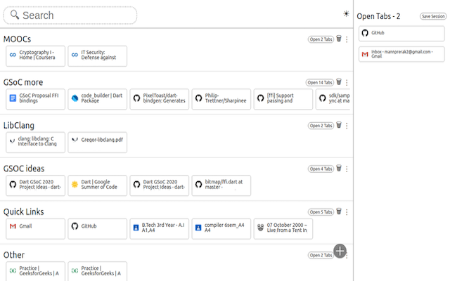
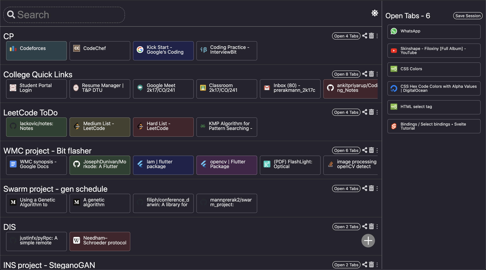
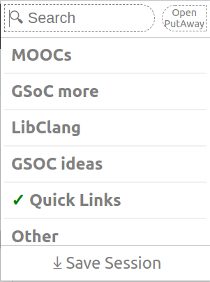

# Put-Away

Save Tabs and Sessions as Chrome bookmarks.

### Features
- Drag and Drop tabs to collections.
- Efforlesly move and search items across collections.
- Share collection links as text.
- Color coding of items with light and dark themes.
- Archive collections, Add Quicklinks.

All the tabs and collections are stored in a Seperate folder - `Other Bookmarks/ Put Away`
So, all of your data is accessible from anywhere,
and is safely stored in your own chrome bookmarks.

## Screenshots
##### New Tab - Light

##### New Tab - Dark

##### Extension Popup
<table>
    <td></td>
    <td>&nbsp</td>
    <td></td>
</table>

## Installing
You can add this [extension from the Chrome Web Store](https://chrome.google.com/webstore/detail/putaway-tab-management/fkfhaaminmefilpjiapgokmlbjfokafa/).

OR

1. You can clone/download this repository OR download the latest [Release](https://github.com/mannprerak2/putaway/releases).
2. **Enable '_Developer Mode_'** on your Chrome(ium) browser at 'chrome://extensions/'
3. **Select '_Load unpacked_'** button and point it to the `public` folder.

## Contributing/Developing

See [CONTRIBUTING.md](./CONTRIBUTING.md).

##### (Made with SvelteJS)