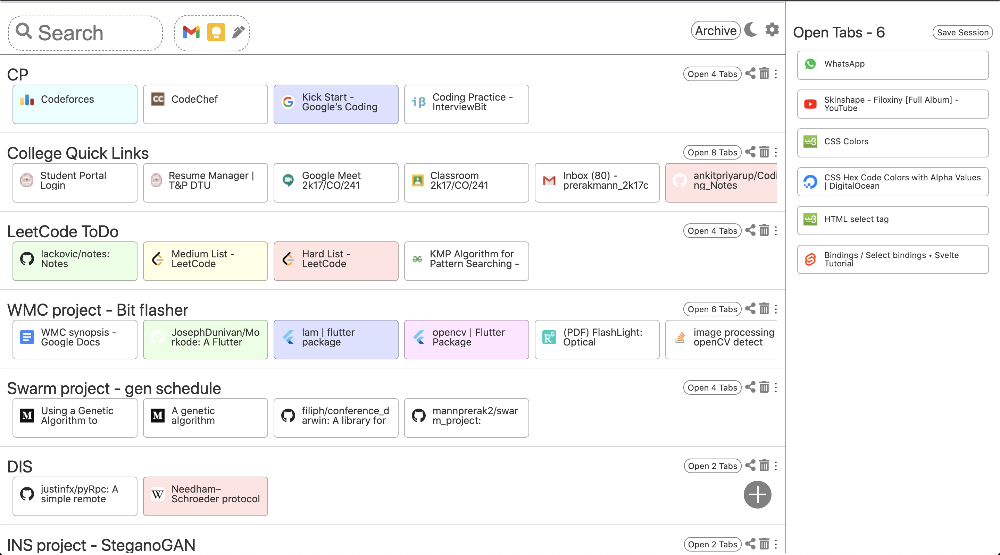
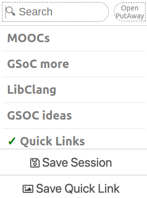

# Put-Away 

Save Tabs and Sessions as bookmarks.

All the tabs and collections are stored in a Seperate folder - `Other Bookmarks/ Put Away`
So, all of your data is accessible from anywhere,
and is safely stored in your own chrome bookmarks.

## Screenshots

## Setting Up
1. **Clone** the repository to your local machine
2. **Enable '_Developer Mode_'** on your Chrome(ium) browser at 'chrome://extensions/'
3. **Select '_Load unpacked_'** button and point it to the `public` folder
4. Experiment

##### (Made with SvelteJS)

## App Structure
`public` - Contains the Extension files

`src` - Contains the Svelte src files

`public/build` - Contains js files generated by Svelte Compiler
